# Data Processing Pipeline

Monorepo for an AWS data processing pipeline driven by S3, EventBridge, SNS, SQS, Golang Lambdas, and SageMaker.

## Structure

- `lambdas/`: Golang AWS Lambda functions
- `proto/`: Protocol Buffer definitions for events and messages
- `terraform/`: Infrastructure as Code for deploying to AWS

## Architecture

```mermaid
flowchart TD
    %% Define Node Styles
    classDef input fill:#e1f5fe,stroke:#0288d1,stroke-width:2px;
    classDef compute fill:#fff3e0,stroke:#e65100,stroke-width:2px;
    classDef messaging fill:#f3e5f5,stroke:#4a148c,stroke-width:2px;
    classDef ml fill:#e8f5e9,stroke:#1b5e20,stroke-width:2px;
    classDef event fill:#e0f7fa,stroke:#006064,stroke-width:2px;

    User([User / External System]) -->|Drops file| S3_Input
    
    %% Storage & Initial Trigger
    S3_Input[(S3 Bucket: Input\n`mskluev-pipeline-input`)]:::input
    S3_Input -->|Triggers 'Object Created'| EventBridge
    
    EventBridge{EventBridge Rule}:::event
    EventBridge -->|Publishes| SNS_Input
    SNS_Input{{SNS Topic:\n`mskluev-s3-input-topic`}}:::messaging
    
    %% Processing Pipeline Part 1
    subgraph S3 Trigger Stage
    SQS_Input[\SQS Queue:\n`mskluev-s3-input-queue`\]:::messaging
    Lambda_S3_Trigger[Lambda:\n`s3-trigger`]:::compute
    SNS_Process{{SNS Topic:\n`mskluev-process-topic`}}:::messaging
    end
    
    SNS_Input -->|Forwards| SQS_Input
    SQS_Input -->|Consumes| Lambda_S3_Trigger
    Lambda_S3_Trigger -->|Publishes\nProcessingEvent| SNS_Process
    SNS_Process -->|Forwards| SQS_Process
    
    %% Processing Pipeline Part 2
    subgraph Data Processing Stage
    SQS_Process[\SQS Queue:\n`mskluev-process-queue`\]:::messaging
    Lambda_Processor[Lambda:\n`processor`]:::compute
    SNS_SageMaker{{SNS Topic:\n`mskluev-sagemaker-topic`}}:::messaging
    end
    
    SQS_Process -->|Consumes| Lambda_Processor
    Lambda_Processor -->|Publishes\nSageMakerEvent| SNS_SageMaker
    SNS_SageMaker -->|Forwards| SQS_SageMaker
    
    %% Inference Pipeline Part 3
    subgraph SageMaker Caller Stage
    SQS_SageMaker[\SQS Queue:\n`mskluev-sagemaker-queue`\]:::messaging
    Lambda_SageMaker[Lambda:\n`sagemaker-caller`]:::compute
    end
    
    SQS_SageMaker -->|Consumes| Lambda_SageMaker
    Lambda_SageMaker -->|API Call:\nInvokeEndpointAsync| SageMaker
    
    %% External / ML Processing
    SageMaker[SageMaker Asynchronous Endpoint]:::ml
    SageMaker -->|Drops inference results| S3_Output
    
    S3_Output[(S3 Bucket: Output\n`mskluev-pipeline-output`)]:::input
```

